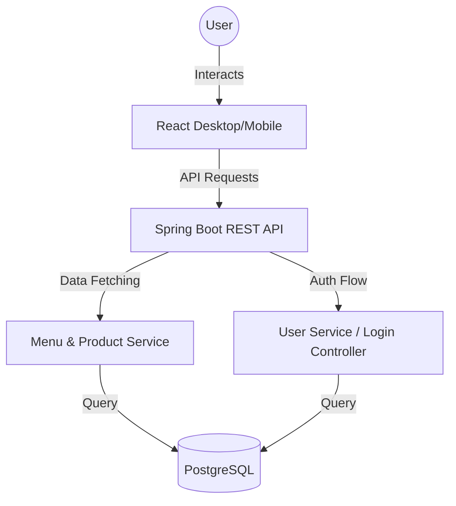

# 🍛 FoodApp (BharatFood) - Modern Indian Culinary Experience

Welcome to **FoodApp**, a premium, full-stack food delivery application that blends traditional Indian aesthetics with modern software innovation. This project features a robust **Spring Boot** backend and a stunning **React** frontend, delivering a seamless experience from discovery to checkout.

---

## ✨ Innovative Features

- **Royal Desi Interface**: An innovative "Modern Royal Indian" design system using a vibrant Saffron (`#FF9933`), rich Gold, and deep background palette. Features immersive glassmorphism and subtle CSS micro-animations.
- **Dynamic Menu Discovery**: Intelligently categorized menu (Burger Hub, Pizza Palace, Fried Chicken, etc.) with real-time dynamic rendering based on the URL path.
- **Smart Cart System**: Context-based global state management (`CartContext`) for a smooth, reactive ordering experience that instantly updates across pages.
- **Secure Authentication**: Dedicated Login and Registration flows ready for integration with robust backend security mechanisms.
- **Featured 'Best Sellers'**: A separate product module for handpicked, trending delicacies fetched directly from PostgreSQL.
- **Responsive Mastery**: Fluid layout ensuring a flawless, premium experience across Mobile, Tablet, and Desktop devices.

---

## 🛠️ Technical Stack

### Frontend
- **Framework**: React (using Vite for blazing fast builds)
- **Language**: TypeScript for type safety and enhanced developer experience
- **Styling**: Vanilla CSS with modern CSS3 Variables and Glassmorphism techniques
- **Routing**: `react-router-dom` for seamless Single Page Application navigation

### Backend
- **Framework**: Spring Boot (Java)
- **Data Access**: JPA / Hibernate
- **Database**: PostgreSQL (Structured for relational integrity and scalability)
- **Build Tool**: Maven

---

## 🏛️ Project Architecture



---

## 🚀 Getting Started

Follow these instructions to get a local copy up and running for development and testing purposes.

### Prerequisites
- **Java 17+**
- **Node.js 18+**
- **PostgreSQL** (Running locally on the default port `5432`)

### 1. Database Setup
1. Open PostgreSQL (via pgAdmin or psql).
2. Create a database named `postgres` (or as configured in your application properties).
3. The Spring Boot application with `ddl-auto=update` will automatically generate the required tables (`menu`, `users`, `products`, etc.) upon startup.
4. *(Optional)* Manually insert some initial menu items and products into the database so the frontend has data to display.

### 2. Backend Setup (`SpringProjrct`)
1. Navigate to the backend directory:
   ```bash
   cd SpringProjrct
   ```
2. Verify database credentials in `src/main/resources/application.properties`:
   ```properties
   spring.datasource.url=jdbc:postgresql://localhost:5432/postgres
   spring.datasource.username=postgres
   spring.datasource.password=your_password
   ```
3. Run the Spring Boot application:
   ```bash
   ./mvnw spring-boot:run
   ```
   *The backend API will start on `http://localhost:8081`.*

### 3. Frontend Setup (`frontend`)
1. Open a new terminal instance and navigate to the frontend directory:
   ```bash
   cd frontend
   ```
2. Install the required NPM packages:
   ```bash
   npm install
   ```
3. Start the Vite development server:
   ```bash
   npm run dev
   ```
   *The React application will be accessible at `http://localhost:5173`.*

---


## 👨‍💻 Development & Contribution
Ensure that backend APIs are running before interacting with dynamic frontend components (like the Menu or Best Sellers) to avoid fetch errors.

*Enjoy building the future of food tech! 🍲*
